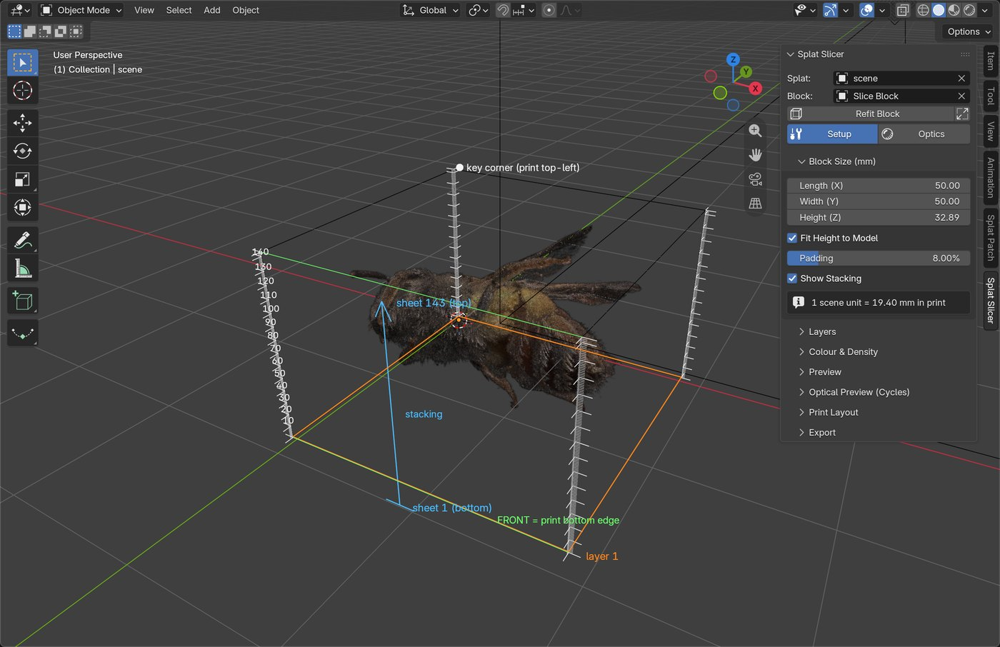
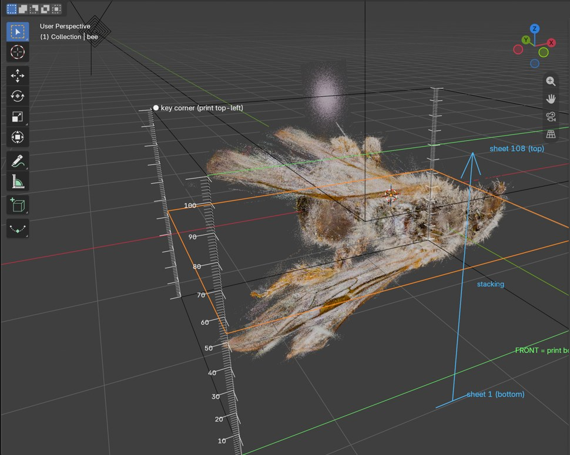
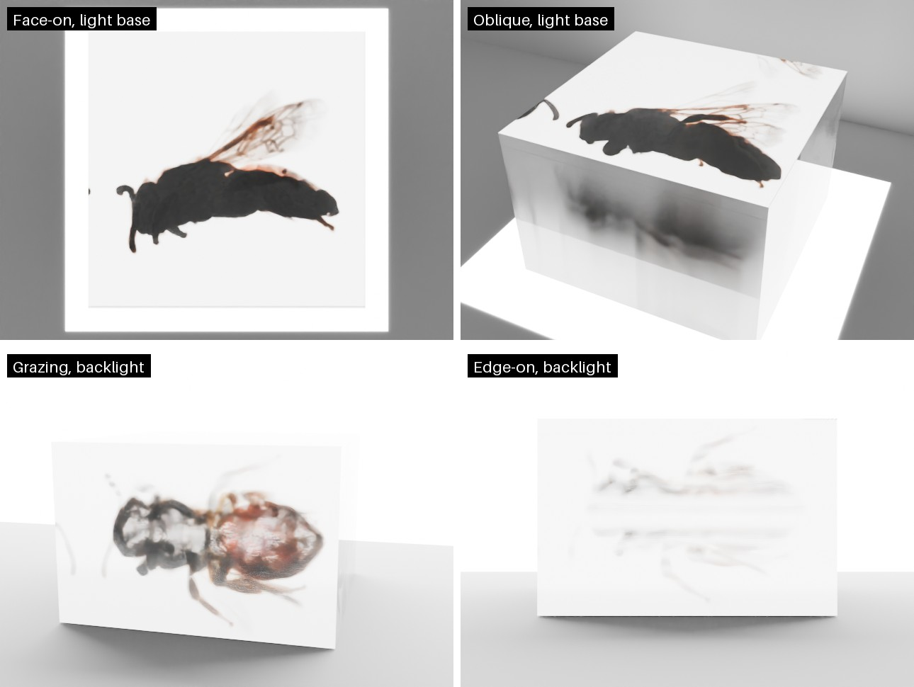
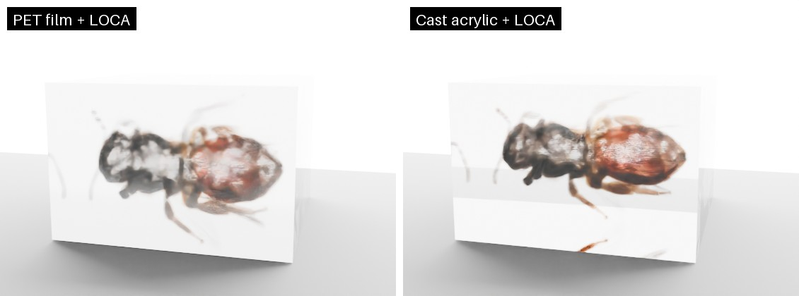
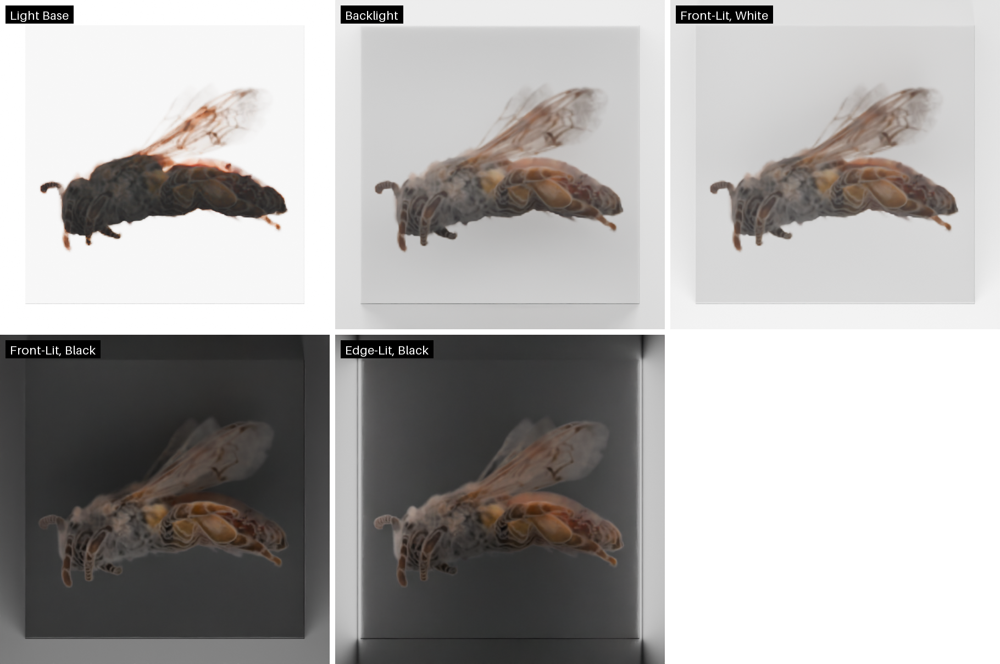
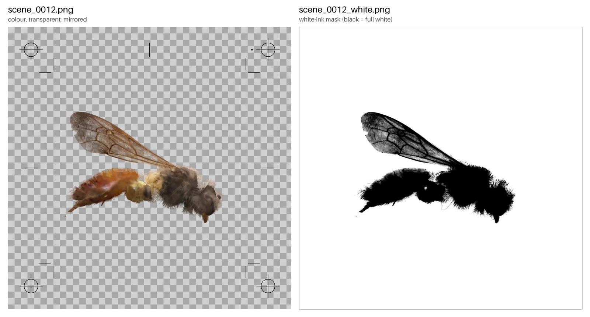
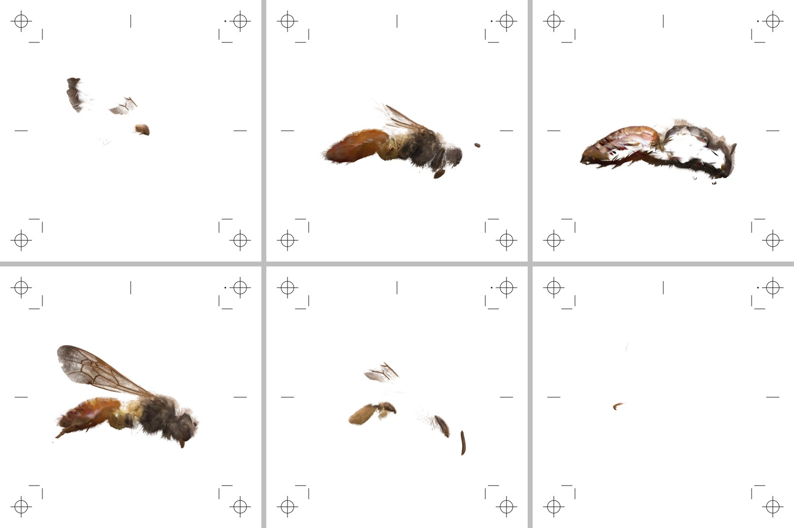
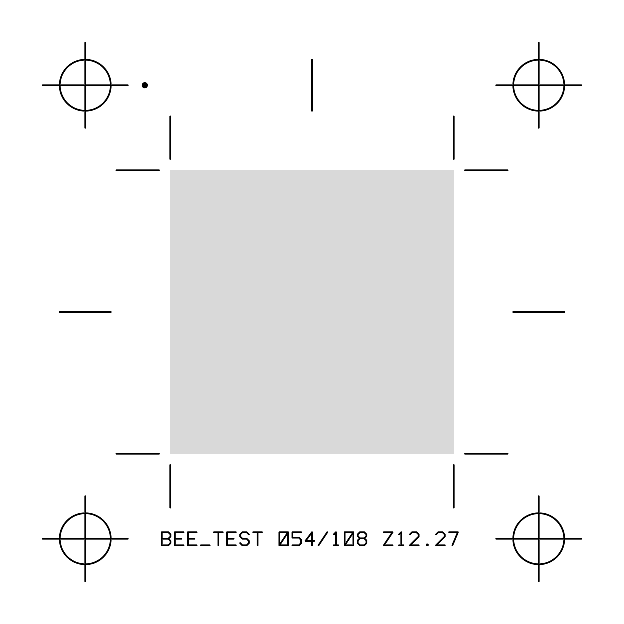

# Splat Slicer (Blender 5.3+)

Plan a clear laminated block around a Gaussian splat and slice it into printable film layers.
Each layer is printed on a clear sheet (e.g. 0.2 mm PET), the sheets are glued (LOCA / UV resin)
and stacked on a registration jig, and the block is trimmed and polished.

Sidebar: **3D Viewport > N > Splat Slicer**. Uses Blender 5.3's native splat import
(`File > Import > PLY / SPZ`).

**New here? Start with the [Quick start guide](docs/QUICKSTART.md)**: a step-by-step walk-through with
screenshots, using a test scan you can download from the
[test-data release](https://github.com/timfennell/blender-splat-slicer/releases/tag/test-data).



## Workflow

1. Import the splat and select it.
2. **Block Size (mm)**: set the finished block's Length × Width × Height.
3. **Create Block**: adds a wireframe box at that size and fits it around the splat. With
   **Fit Height to Model** (on by default), the model is scaled to fill Length × Width and the Height is set
   to the model's height plus padding, in whole layers, so no sheets are spent on empty space. Turn it off to
   keep your own height. **Refit Block** repeats the fit. Move, rotate or scale the box to frame the model. Whatever is inside the box gets printed, and the box's
   axes are the block's axes. The panel shows the print scale ("1 scene unit = 11.46 mm").
   Uniform scale only, or the model gets stretched (the panel warns).
4. **Layers**: film thickness + bond line (cured glue) = layer pitch. Better: laminate a test
   stack, measure it, and tick **Use Measured Stack** (e.g. 5 sheets = 1.15 mm → 0.23 mm pitch).
   The layer count is how many whole layers fit the height. Any leftover is split between top and bottom.
   **Show Stacking** draws the stack on the block (see below).
5. **Preview**: step through layers. The layer is drawn inside the block on a faint frosted sheet,
   in any viewport shading. It also goes into two images: *Splat Slice* (colour + opacity) and
   *Splat Slice Print* (exactly as it will print).
6. **Export**: PDF and/or PNGs, plus optional volumes.

## Setup and Optics views

The **Setup | Optics** switch at the top of the panel flips between:

- **Setup**: the splat, the slice preview and the stacking guides
- **Optics**: the finished block as Cycles glass (see below), in Rendered shading

The first press of Optics builds the mock-up. After that, switching is instant. Setup puts the viewport's
shading back. Use **Rebuild Optical Block** after changing settings.

## Stacking overlay



With **Show Stacking** on, the block shows:

- a ruler of layer ticks up the vertical edges, longer and numbered every 10 layers
- a blue arrow beside the front face, from **sheet 1 (bottom)** to the **top sheet**
- the previewed layer outlined in orange
- the **FRONT** edge in green: this is the bottom edge of every printed image
- the **key corner** (back-left, top): the printed image's top-left, where the orientation dot sits
  beside the registration mark

## Optical preview (Cycles)



*0.2 mm film (143 sheets), Ink Density 0.3, Brightness 4.6, Fine quality.*

Pick the **Material** first. Each preset sets the refractive indices, haze, side finish (polished) and ink scatter:

| Preset | Film n | Glue n | Interface haze | Ink scatter |
|---|---|---|---|---|
| **PET film, inkjet-coated + LOCA** (default) | 1.575 | 1.49 | 0.03 (ink-receptive coating) | 0.15 |
| **PET film, uncoated + LOCA** (eco-solvent / UV ink) | 1.575 | 1.49 | 0 | 0.08 |
| **Cast acrylic + LOCA** (eco-solvent / UV ink) | 1.491 | 1.49 | 0 | 0.08 |

Changing any value by hand switches the menu to *Custom*.



*10° above the layers, Fine quality. Both stay readable. PET (left) is a little softer, with fine striping
from its index step and coating haze. Cast acrylic (right), with indices matched to the glue, is crisper.*

**Build Optical Block** builds the laminated block as Cycles glass:

- film sheets at the film IOR (PET 1.575 by default)
- each sheet's ink on its top face: transmission = the printed colour, plus a little pigment scatter
- at **Fine** quality, two refracting interfaces per glue line, at the glue IOR (LOCA 1.49)
- the block's sides, polished or sanded (**Side Finish**)

**Fast | Fine** quality:

- **Fast** (default): ink planes and the block only, half-resolution viewport, 16 samples, denoised.
  The glue layers are thin and parallel: refracting into one and out again leaves a ray's direction
  unchanged, so skipping them barely changes the picture.
- **Fine**: adds every glue interface (and their **Interface Haze**), at full resolution and 64 samples,
  for a final look.

Switching between them is instant; no rebuild needed.

The splat and the slice overlay are hidden while it shows. **Lighting** picks the display setup:

| Lighting | Setup | What it tells you |
|---|---|---|
| **Light Base** (default) | bright pad under the block, dim grey surroundings | the classic display: full colour through the top |
| **Backlight** | bright panel behind the block | front and side views, lit through |
| **Front-Lit, White** | soft front light, white backdrop | room light on a white shelf: the backdrop bounces light back through |
| **Front-Lit, Black** | soft front light, black backdrop | the hardest case without white ink: dim and murky |
| **Edge-Lit, Black** | light strips against the side faces, black backdrop | only scattering ink lights up |
| **Scene Lighting** | none | your own lights and world |



*Face-on (orthographic, looking down through the top), Fast quality: 1 mm film (32 sheets), Ink Density 0.3,
Brightness 4.6. Light Base shows pure transmission, so the dense body still stacks up dark; the other setups
add light scattered by the pigment.*

Every light is a glowing panel, so its brightness doesn't depend on how far the block box is scaled.
Panels that stand in for lamps are hidden from the camera. Optics mode uses its own world (background),
and Setup puts your scene's world back. Changing the lighting is instant. When the build finishes, the viewport switches to Rendered shading at an oblique
view. Glass only reads in Rendered shading; in Solid it looks like a grey box. Cycles uses the GPU when
one is enabled in *Preferences > System > Cycles Render Devices*, with viewport denoising on.
**Face-On / Oblique / Grazing / Edge-On** point the viewport at the block.

What it shows, in the order above:

- **Face-on**, down the stack: the model reads cleanly through the faces of the sheets.
- **Oblique**: still clear through the top. Through the sides it softens.
- **Grazing**: inside the film, light meeting the lower-index glue beyond the critical angle
  (asin(1.49 / 1.575) ≈ 71° from the stack axis, i.e. within 19° of the layers) is totally reflected.
  That light stays in its own sheet, which is where a straight ray would have gone anyway, so the side
  view stays readable. The image is only mirrored within strips one film thick, too fine to notice.
- **Edge-on**: the ink sits on planes one pitch apart, so the model breaks into fine stripes.

The panel shows the critical angle for the IORs you enter. What degrades side views in practice is the
striping from the discrete ink planes, coating haze (**Interface Haze**) and the side finish. Matched
indices (acrylic sheets 1.49 with LOCA 1.49) remove the interface reflections entirely.

The model is physical, so it's also a fair check on darkness. Opaque splat surfaces (a bee's body)
stack up to near-black in transmission. Lower **Ink Density** before building to see a lighter
print, or raise **Ink Scatter** to imitate pigment or white ink.

**Speed.** On an Apple M2 Pro GPU, the 108-sheet bee block builds in about 1 s. At 480 × 360 and 32
samples, a Fast render takes 2.4 s at grazing (Fine: 6.3 s) and 5.4 s oblique (Fine: 18.6 s). In the
viewport, orbiting at Fast settles in a few seconds.

*Earlier versions capped Cycles' glossy bounces at 16. Light trapped in a film layer reflects more often
than that, so those paths were cut off and drawn black, a false "dark mirror band" at grazing angles.
The cap now covers every sheet.*

## What a slice is

Layer *k* owns the slab of the block from `k × pitch` to `(k+1) × pitch`. The slabs tile the height
with no gaps (the glue line is part of each layer's slab). Everything inside a slab is flattened into
that layer's image. A splat that straddles slabs is **split** between them in proportion to how much
of its Gaussian lies in each (exact normal-CDF integral). It isn't cropped whole, and it isn't
clipped at a plane. Stacking every layer gives the whole splat back, with nothing counted twice.

**Density.** A 3DGS splat has an opacity, not a physical density. Each splat becomes an absorbing
density whose optical depth, looking straight through it along its thinnest axis, equals its
opacity. So a surface keeps its trained opacity from whichever side it faces, not just from the top.
Within a layer, splats mix by optical depth. **Ink Density** scales everything, to calibrate how dark
the stacked block comes out. **Ignore Below** drops faint haze and floaters.

**Colour.** Ink looks the same from every direction, so each splat gets one colour:

- **All Sides (SH off)**, the default: the SH averaged over every view direction. That is exactly the
  DC term, and also exactly what six cameras on the six faces would give (odd SH bands cancel between
  opposite faces and band 2 sums to zero), so rendering from each side would add nothing.
- **Favour a Face**: the full SH averaged over a cone of view directions around one face. This bakes
  in the sheen and highlights the capture saw from that side, for a block mostly seen from the front.

## Printing guide

Ink on clear film can only absorb light: there is no way to print a spot lighter than the clear film itself.
White and pale parts of a model print as clear, and the block is meant to be seen with light coming
through it. Whether you also print **white** decides the route.

### Route 1: pigment inkjet, no white (simplest, best image quality)

Print CMYK on inkjet-coated film and display the block on a **light base** (the *Light Base* lighting in
the Optics view shows the result).

- **Why pigment, not dye:** pigment particles stay put under liquid LOCA or resin, where dye can bleed;
  they scatter a little light, which gives the model some body even lit from the front; and they resist
  fading on a light base.
- **Printers:** Epson SureColor **P700** (13") or **P900** (17"): pigment ink, very fine dot placement
  (consistent from sheet to sheet), a straight feed for stiff film, and no clear "gloss optimizer" layer that
  could haze the stack. Budget alternative: Canon imagePROGRAF **PRO-300** (test its Chroma Optimizer clear
  coat on film first). Check that a printer's colours are actually pigment: many "photo" printers, including
  the EcoTank photo models, use dye colours with only a pigment black.
- **Film:** water-based ink needs **inkjet-coated** film; on bare PET or acrylic it beads up. Pictorico's
  premium OHP transparency film is the well-known high-clarity reference (used for digital negatives);
  screen-print positive films are a thicker, cheaper alternative.
- **Driver settings:** print at 100% (no "fit to page"; the PDF is true size), turn off **High Speed**
  (bidirectional) printing for sharper, more accurate dots, use **Photo Black**, and keep media type, quality
  and colour settings identical for every sheet.
- **In the add-on:** *Printer → Inkjet (No White)*: PDF and print PNGs, sheets laid printed side **up**.

### Route 2: DIY DTF, white on film from a converted EcoTank (cheapest white)

DTF (direct-to-film) printers are consumer Epson inkjets converted to CMYK plus **white** ink. They're made
for T-shirt transfers, but what they actually do is print colour plus white on PET film, which is this medium.

- **Ready-made:** A4/A3 DTF printers built on Epson L1800, XP-600 or ET-8550 engines (Procolored and similar),
  roughly $500 to $1,500 including RIP software.
- **DIY conversion:** an Epson **ET-8550** (A3+, six channels: CMYK plus white, often in two channels for
  density, and a rear feed for stiff film) or an L1800, filled from new with DTF CMYK plus white inks and
  driven by a RIP such as AcroRIP. Roughly $400 to $700 all in.
- **Before you buy:**
  - **Fill with DTF ink from day one.** Never load Epson's own ink first; flushing it out later is wasteful
    and messy.
  - **White ink needs care.** It's titanium dioxide, which settles and clogs: agitate or circulate it, shake
    the tank and print a small test every few days. Neglect is the usual way these printers die.
  - **Warranty:** expect the conversion to void it.
  - **The RIP software is the catch on a Mac.** The Epson driver can't control white, and the common DTF RIPs
    (AcroRIP, Maintop, CADlink Digital Factory, bundled vendor RIPs) are Windows-only as far as we know. Plan on
    a cheap Windows PC to drive the printer; virtual machines on Apple Silicon are unreliable with these USB
    drivers.
  - **Film:** DTF film has a matte coating that's somewhat hazy. Try it, and also try clear inkjet transparency
    film with the DTF inks.
- **In the add-on:** *Printer → White-Ink RIP (DTF / UV)*: mirrored transparent tiles with marks, plus a
  matching `_white.png` mask beside each, and a `RIP_README.txt`.
  - In the RIP, build white from the transparency as a **gradient**, or load each `_white.png` as the white
    layer. Never a solid white underbase, which turns the block milky.
  - DTF prints colour first and white on top, so lay every sheet **printed side down**. Seen through the film,
    colour then sits in front of its white, the label reads correctly and the key dot is top-left.

### Route 3: UV printers and sign shops (white on acrylic, highest cost)

UV ink cures instantly, sticks to uncoated PET and acrylic, and includes white (often gloss too). It pairs
with **cast acrylic + LOCA**, the crispest stack in the Optics view.

- **Desktop UV:** Epson SureColor V1070, eufyMake E1 and similar, roughly $2,000 to $6,000: slower and less
  fine than a pigment photo printer, and the white needs regular maintenance.
- **Sign shops** (Mimaki, Roland UV flatbeds) print by the sheet or by area, so **gang every slice onto one
  sheet**: in *Print Layout*, set **Sheet → Custom** to the shop's sheet or bed size. The 189 slices of a
  66 × 50 mm block (tiles 90 × 74 mm with marks) fit on one sheet about **1.2 m square** (13 × 15 tiles on a
  4 × 4 ft sheet), or about 1.1 × 1.0 m with an 8 mm margin.
- **Ask the shop:** which spot-colour name their software uses for white (Roland uses "RDG_WHITE"); whether they
  print on your film or acrylic or supply their own; and who cuts the sheet apart.
- Start with a few test sheets: send the RIP PNGs and white masks for a handful of slices.

### Glue, calibration and display

- **Calibrate the pitch.** Laminate a 5-sheet test stack with your glue under the same weight and UV cure, measure
  it, and enter it under **Use Measured Stack**. The same stack shows whether the ink and film coating survive
  the glue (some coatings cloud or swell under UV resin).
- **Darkness.** Solid parts of a model stack up ink on many sheets and can go nearly black. Lower **Ink Density**
  and compare in the Optics view before printing.
- **Display.** Light has to pass through the ink toward the viewer. A light base under the block (viewed from
  above or at an angle) is best: light goes through the faces of the sheets, the clearest direction. A light
  behind it works for side views; front light needs a white surface behind the block; edge lighting only shows
  what scatters (pigment faintly, white ink strongly).

Printer models and prices are approximate (2026) and change often; check current listings.

## Printer presets

**Print Layout > Printer** sets the outputs and mirroring for the kind of printer. You can still change them after.

| Printer | Outputs | Sheets |
|---|---|---|
| **Inkjet (No White)**: pigment inkjet, e.g. Epson P700 / P900 | PDF + print PNGs over white | laid printed side **up**; show the block on a light base |
| **White-Ink RIP (DTF / UV)**: e.g. an EcoTank converted to DTF inks, or a UV printer | `rip/` folder: mirrored tiles on a transparent background, with a matching `_white.png` mask beside each one, and `RIP_README.txt` | laid printed side **down** |

In a white-ink RIP, build white from the tiles' transparency as a **gradient**, or load the `_white.png`
files as the white layer. Don't use a solid white underbase: that would make the block milky. White
printers usually print colour first and white on top, so each sheet is flipped. Mirroring the tile means
that, seen through the film, the picture, label and key dot all read correctly, with colour in front of its white.



*Slice 12 of a 32-sheet export of the 4.13-million-splat bee (1 mm film, 720 dpi, Ink Density 0.3).*

## Print outputs



*Slices 4, 7, 10, 12, 14 and 17 of the same export, shown over white as they print (mirrored, since it was
exported for a white-ink printer; slice labels were off).*

| Output | What |
|---|---|
| **PDF** | One slice per page at exact size, or tiled onto Letter / Legal / Tabloid / 13×19 / A4 / A3 / A3+ / custom sheets (both orientations tried). Print at 100%, no scaling. |
| **Print PNGs** | One tile per slice with marks, DPI embedded so it prints at true size. |
| **Raw RGBA PNGs** | Slice colour + opacity, no marks, for other printers or pipelines. |
| **RIP PNGs (Transparent)** | The tile with marks on a transparent background: slice colour with its opacity as alpha, marks in black. Composited over white it's identical to the print tile. For RIPs that build white from transparency. |
| **White Ink Mask** | Greyscale per slice, aligned with the tile (black = full white ink, no white in the margins), for printers with a white channel. On clear film, white = no ink, so white parts of a model are otherwise invisible. |

Each tile has a margin (default 12 mm) with:

- a crosshair-in-circle at each corner, centred half a margin outside the image corner
- mid-edge ticks on three sides
- an orientation dot beside the top-left mark, so a sheet can't go in flipped or turned
- corner cut ticks at the image edge
- a label: name, slice number / total, height of the slab bottom (mm)

Layer 1 is the **bottom** sheet. Images are the block seen from above, front (−Y) edge at the bottom.
**Mirror Tile** flips the whole tile (picture, marks and label) for sheets laid printed side down.



## Volume outputs

The same layers as a scaled volume, at their own in-plane voxel size (**Voxel XY**). The Z spacing is the
layer pitch, and all units are millimetres.

| Format | Contents |
|---|---|
| **DICOM** | One `.dcm` holding every layer (Multi-frame True Color Secondary Capture, colour on black). Pixel spacing and orientation are in the shared functional groups, and each frame's position is in the per-frame groups. SimpleITK / GDCM, the reader behind 3D Slicer, loads it as one 3D volume with the right spacing. Untick **DICOM as a Single File** for a `dicom/` folder with one file per layer, for viewers that only read classic series. |
| **NIfTI** | `.nii.gz`, RGBA32 (colour + opacity), sform/qform in mm. |
| **NRRD** | `.nrrd`, RGBA uint8, gzip, space directions in mm. |

Checked with pydicom, SimpleITK, nibabel and pynrrd: every reader recovers the same voxels and spacing.

## Speed

On the 130k-splat bee in a 40 × 30 × 25 mm block (108 layers at 720 dpi, 1134 × 850 px per slice), a full
export (PDF on Letter, print PNGs, DICOM at 0.25 mm) takes about 30 s. A single-layer preview at 0.1 mm takes
0.3 s. The export runs in steps with a progress bar; **Esc** cancels and keeps the files written so far.

On the 4.13-million-splat *Bee Extra Extra Large* scan (66.2 × 50 mm block):

- import: 4 s
- first preview: 6 s; then about 2 s per layer, since the slicer setup is cached while you step
- optical mock-up: 27 s
- full export, 170 layers at 720 dpi + DICOM: about 11 min, peak memory under 5 GB

## Notes and limits

- **Built against the Blender 5.3 alpha.** It reads splats from the attributes 5.3's importer creates
  (`radiance:base`, `radiance:sh_0..14`, `scale`, `rotation`; the SH ordering is checked against the source PLY).
  Splats erased with *Gaussian Splat Patch* (hidden, opacity 0) are skipped.
- **Colours are RGB.** The printer driver does the CMYK conversion. Opacity and colour on clear film depend on
  the ink and film, so print a short test stack and adjust **Ink Density**.
- **On-screen boost only.** The viewport slice's opacity is boosted so a single thin layer shows up.
  The images and exports are not boosted.
- **The block box doesn't render.** It's a guide: wireframe in Solid view, and its Cycles ray visibility is off,
  so it doesn't appear in renders or the Rendered viewport.
- **The marks are drawn in-house.** Labels use a built-in stroke font, because Blender's font drawing needs a
  GPU context that background exports don't have.

## Install

Download `gs_slicer-*.zip` from [Releases](https://github.com/timfennell/blender-splat-slicer/releases),
then in Blender use **Edit > Preferences > Get Extensions > ⌄ > Install from Disk…** and pick the zip.
Requires Blender 5.3 or newer.

To build it from source:

```bash
blender --command extension build --source-dir gs_slicer --output-dir dist
```

```bash
blender --command extension install-file -r user_default -e dist/gs_slicer-0.1.0.zip
```

## Test data and license

The *Bee Extra Extra Large (4.13 Million Splats)* scan used in the quick start and in the images here is
attached to the [test-data release](https://github.com/timfennell/blender-splat-slicer/releases/tag/test-data) as
`bee_extra_extra_large.zip` (342 MB; unzips to `scene.ply`, 974 MB). Rotate it 180° on X after import. It's by [Tim Fennell](https://superspl.at/user/timfennell)
([view it on SuperSplat](https://superspl.at/scene/de6f7e2b)) and licensed
[CC BY 4.0](http://creativecommons.org/licenses/by/4.0/): credit the author; commercial use is allowed.

Splat Slicer itself is GPL-3.0-or-later (see [LICENSE](LICENSE)).

