# Splat Slicer quick start

From a Gaussian splat scan to print-ready sheets in about ten steps. Every screenshot here is from a real
session with the 4.13-million-splat *Bee Extra Extra Large* scan in Blender 5.3. For what each setting
does in depth, see the [README](../README.md).

**Test data:** the same bee scan is attached to the
[test-data release](https://github.com/timfennell/blender-splat-slicer/releases/tag/test-data) as
`bee_extra_extra_large.zip` (342 MB; unzips to `scene.ply`, 974 MB). *Bee Extra Extra Large (4.13 Million
Splats)* by [Tim Fennell](https://superspl.at/user/timfennell)
([view it on SuperSplat](https://superspl.at/scene/de6f7e2b)), licensed
[CC BY 4.0](http://creativecommons.org/licenses/by/4.0/).

## 1. Import the splat and stand it the right way up

**File > Import > PLY / SPZ**, and pick `scene.ply`. A 4-million-splat scan takes a few seconds.

This scan imports lying the wrong way for the block, so rotate it: select it, press **N** for the sidebar,
and on the **Item** tab set **Rotation X = 180°**. With the bee on its side like this, the top of the block
shows its profile. Rotate your own scan so that whatever you want to see through the top of the block
faces up (+Z).

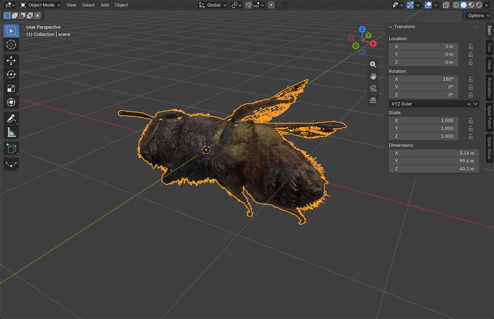

## 2. Open the Splat Slicer tab

In the same sidebar, click the **Splat Slicer** tab.

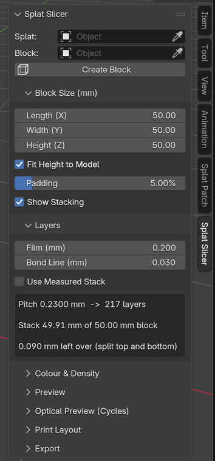

## 3. Set the block size and create the block

Under **Block Size (mm)**, enter the finished block's **Length** (here 50 mm). Leave **Fit** on
*Width & Height to Model*: the other two sizes are worked out from the model. **Margin (mm)** is the clear space
left between the model and every side of the block. Then, with the splat selected, click **Create Block**.

The wireframe box is the block. The model is scaled so its length plus the margins fills Length, and Width and
Height follow the model's proportions, with Height rounded up to whole layers. The panel shows the print scale.

*(The screenshots in this guide were taken with an earlier version that used a 50 × 50 mm footprint and a
percentage padding, so your block will come out a little different: with Length 50 and a 2 mm margin, this bee
fits a 50 × 34.69 × 35.88 mm block, 156 sheets.)*

The overlay shows how the sheets stack:

- **Blue arrow:** sheet 1 (bottom) to the top sheet.
- **Ruler:** layer ticks up the edges.
- **Green:** the **FRONT** edge, which is the bottom edge of every printed image.
- **Key corner:** where the orientation dot is printed.

Move, rotate or scale the box to reframe the model. **Refit Block** (or the arrows icon) fits it again.

## 4. Set the layer thickness

Under **Layers**, enter your **Film** thickness and the cured **Bond Line** (glue) thickness. They add up to
the **pitch**: 0.2 + 0.03 = 0.23 mm, so this block is **143 sheets**.

Once you've made a test stack, tick **Use Measured Stack** and enter its sheet count and measured height. That
measured pitch is more accurate than the nominal thicknesses.

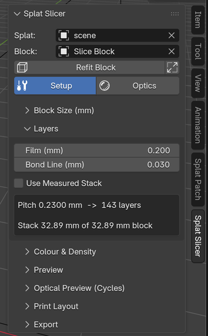

## 5. Preview a layer

Under **Preview**, pick a **Layer** (arrows step through them) and click **Preview Layer**. With **Live** on,
it updates as you change settings.

The layer is drawn inside the block on a faint frosted sheet, at the strength it will print. Here, layer 71
cuts through the middle of the bee: the dark outline is its shell seen edge-on. **Boost Faint Ink** exaggerates
faint ink if a layer is hard to see.

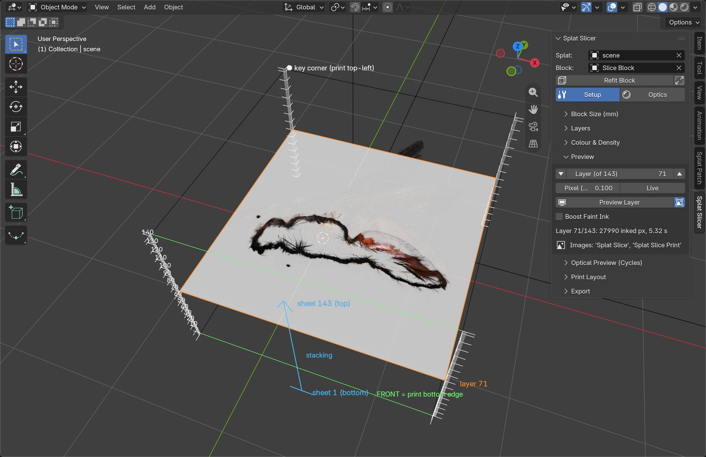

The same layer, exactly as it will print, with registration marks, cut ticks and its label, is in the image
*Splat Slice Print* (open it in an Image Editor):

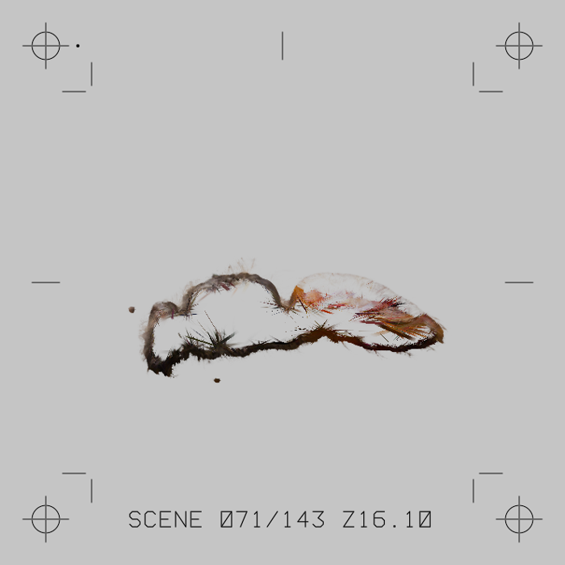

## 6. Colour and ink density (optional)

- **Colour:** *All Sides (SH Off)* is right for most prints. *Favour a Face* bakes in the sheen seen from one
  side (**Cone** sets how wide a range of view angles is averaged).
- **Ink Density:** lower it if the stacked block comes out too dark. Solid parts of a model stack ink on many
  sheets.
- **Ignore Below:** drops faint haze and floaters.

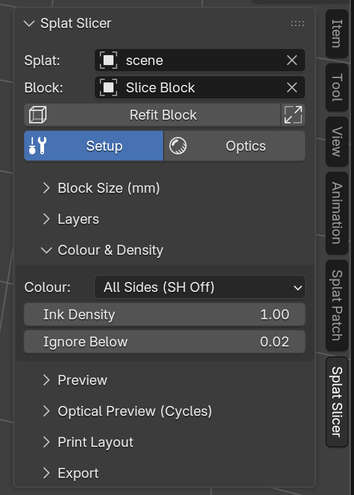

## 7. See the finished block: Optics

Click **Optics** (next to **Setup**). The first time, it builds a glass model of the laminated stack, about
10 s for this scan with a progress bar in the panel, and switches the viewport to Rendered.

- **Lighting:** choose the display. *Light Base* is the classic lit-from-below display.
- **Brightness:** brighter or dimmer lights.
- **Fast | Fine:** quick to orbit, or the full model for a final look.

Click **Setup** to go back to the bee and the guides.

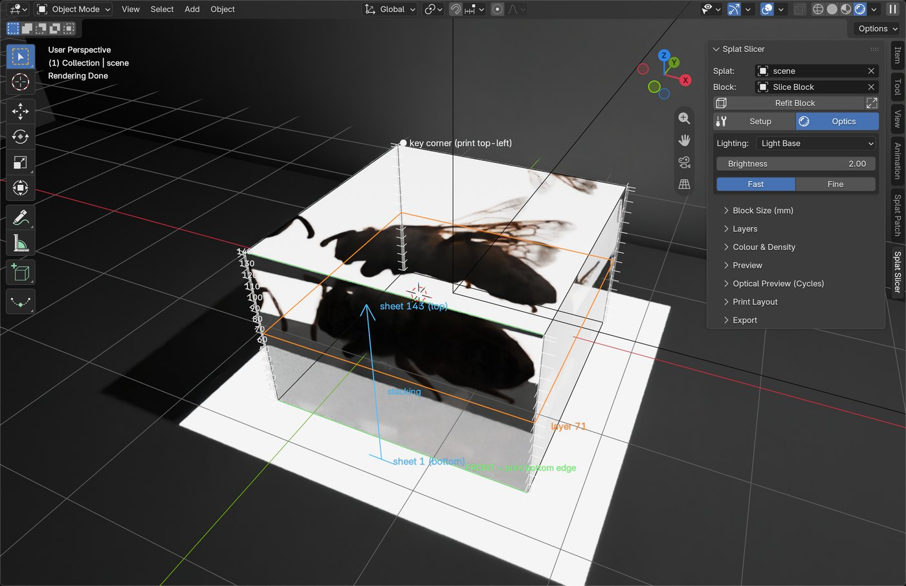

The **Optical Preview** section holds the details. **Material** picks the sheet and glue (PET film or cast
acrylic). The **Face-On / Oblique / Grazing / Edge-On** buttons jump to standard views. **Rebuild Optical Block**
after changing block or colour settings.

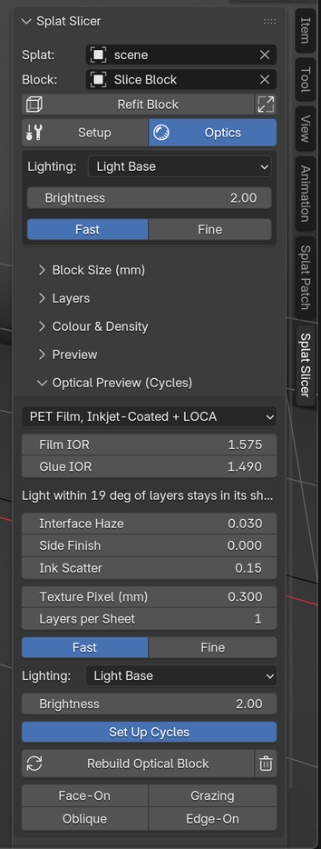

## 8. Choose the printer and layout

Under **Print Layout**, pick the **Printer**:

- **Inkjet (No White):** a pigment inkjet. Writes a PDF and print PNGs; lay sheets printed side **up**.
- **White-Ink RIP (DTF / UV):** a printer with white ink. Writes mirrored transparent tiles and white masks;
  lay sheets printed side **down**.

Then check:

- **DPI:** 720 is a good default for pigment inkjets.
- **Margin:** room for the registration marks.
- **Sheet:** paper size for the PDF. *One Slice per Page*, or tile many slices onto Letter, A3+ or a custom
  size (e.g. a sign shop's sheet).

The line at the bottom shows each slice's pixel size and the tile size.

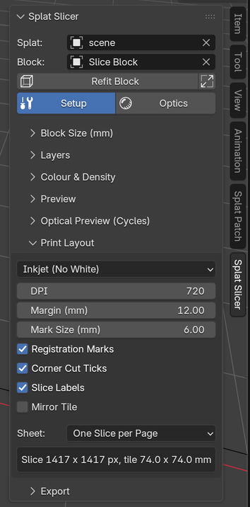

## 9. Export

Under **Export**, set the **Name** and **Folder**, tick the outputs you want, and click **Export Slices**.
Progress shows at the top of the panel; the **✕** cancels and keeps what's been written. The full 143-layer
bee at 720 dpi takes several minutes.

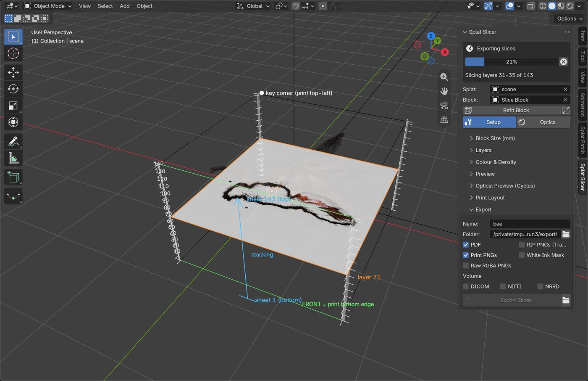

### What the PDF looks like

With **Sheet: Letter**, slices are tiled several to a page at true size. Each tile has its registration marks,
corner cut ticks and label (name, sheet number / total, height). Print at **100%, no scaling**.

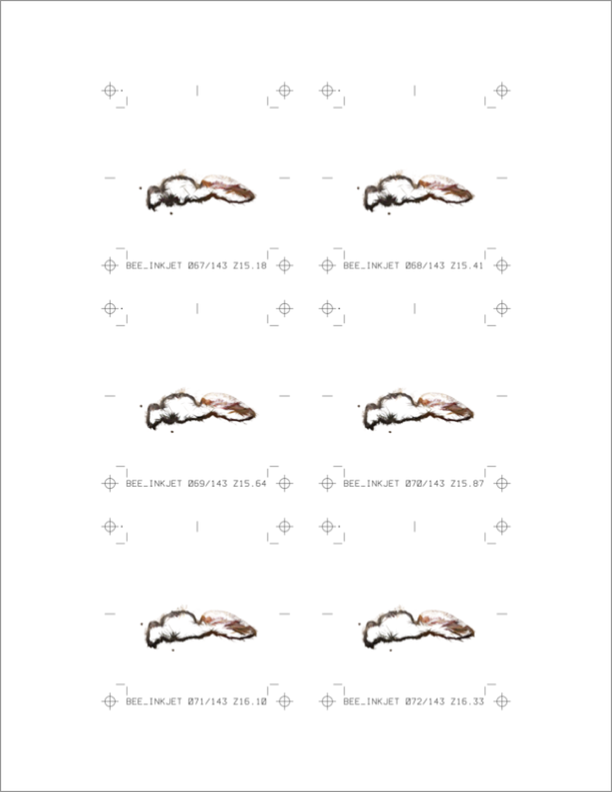

*Page 12 of 24: layers 67–72, six per Letter page. Exported at 300 dpi for this guide; the layout is the
same at 720.*

### DTF / white-ink files

With **Printer: White-Ink RIP**, the `rip/` folder holds a pair of files per slice:

- **`bee_0071.png`:** the colour tile on a transparent background (shown here over a checkerboard). It's mirrored
  because white printers lay white over colour, so the sheet is flipped printed side down.
- **`bee_0071_white.png`:** the matching white-ink mask (black = full white ink). White goes only where the
  bee is, at partial strength where the bee is faint.

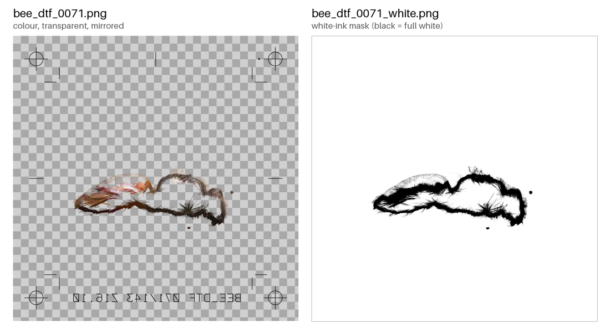

In the printer's RIP, build white from the tile's transparency as a **gradient**, or load the `_white.png`
as the white layer; never a solid white underbase. `RIP_README.txt` in the folder repeats the settings and the
stacking order.

## 10. Print, stack and laminate

1. **Print** every sheet with identical printer settings.
2. **Stack from sheet 1 (the bottom).** Align each sheet on the registration marks: the key dot at top-left,
   the FRONT edge (each image's bottom edge) toward you.
3. **Glue and cure** each sheet under the same light, even weight.
4. **Trim** the margins with the marks, and sand and polish the sides.
5. **Display** it on a light base.

For printer choices (pigment inkjet, DIY DTF on a converted EcoTank, UV and sign shops), see the
[Printing guide](../README.md#printing-guide) in the README.
